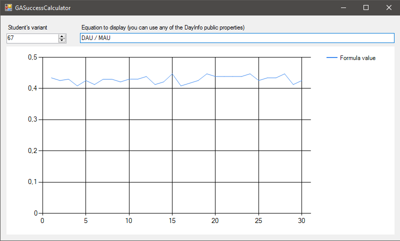

# GASuccessCalculator
University Game Analytics laboratory class #3 for visualisation of the statistic values of an app.

# How it works
The program uses refactored code of *Alexander Samantsov* and the C# library [NCalc](https://github.com/sheetsync/NCalc).

# How to use
- Run the program
- Enter your variant
- Enter equation
- Have fun
